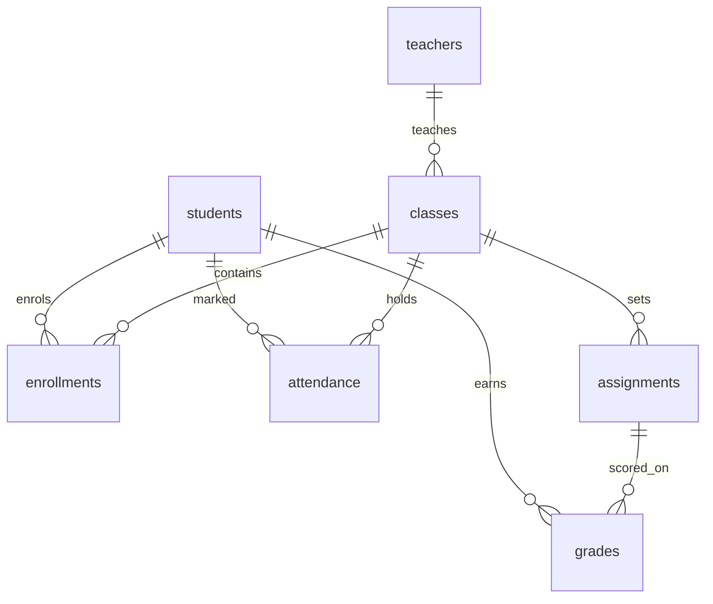

# EduConnect data model

All people in this project are invented by [Faker](https://faker.readthedocs.io/). The IDs are course-work numbers. They are not South African ID numbers, and there are no real parent phone numbers or email addresses. That is how the project stays POPIA-safe.

## Tables

The database script is `sql/schema.sql`. It is in third normal form: each fact is stored in one place, and each column depends on the key of its own table.

| Table | What one row means |
| --- | --- |
| `teachers` | One teacher. |
| `students` | One learner and the grade they are in. |
| `classes` | One subject group, for one grade, taught by one teacher. |
| `enrollments` | One learner sits in one class. |
| `assignments` | One piece of work for a class, including its maximum score. |
| `attendance` | One mark (`present`, `absent`, or `late`) for one learner in one class on one day. |
| `grades` | One score for one learner on one assignment. |

`enrollments` exists so a learner's name is not copied onto every class they take. `assignments` exists so the maximum score is not copied onto every learner who wrote that test.

## How an event maps onto the tables

A stream event is one JSON object. The sample attendance event is `data/samples/attendance_event.json`:

```json
{
  "event_id": "b7e1c2a0-4f3d-4a1e-9c2b-8d6f0a1e2b3c",
  "event_type": "attendance",
  "event_time": "2026-10-06T07:46:12+02:00",
  "student_id": 1001,
  "class_id": 10,
  "attendance_date": "2026-10-06",
  "status": "absent"
}
```

That object becomes one row in `attendance`. `student_id` and `class_id` must already exist on `students`, `classes`, and `enrollments`.

A grade event uses the same idea:

```json
{
  "event_id": "3fa85f64-5717-4562-b3fc-2c963f66afa6",
  "event_type": "grade",
  "event_time": "2026-10-06T15:10:00+02:00",
  "student_id": 1001,
  "class_id": 10,
  "assignment_id": 501,
  "assignment_title": "Fractions quiz",
  "score": 18,
  "max_score": 25
}
```

`assignment_title` and `max_score` are repeated on the event so a later stream reader can understand the record on its own. In PostgreSQL those two values live once, on `assignments`. The `grades` table stores `student_id`, `assignment_id`, and `score`.

## Relationships


